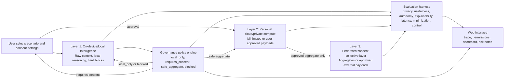

# Architecture Diagram

```mermaid
flowchart LR
  User["User selects scenario and consent settings"]
  L1["Layer 1: On-device/local intelligence\nRaw context, local reasoning, hard blocks"]
  Gov["Governance policy engine\nlocal_only, requires_consent, safe_aggregate, blocked"]
  L2["Layer 2: Personal cloud/private compute\nMinimized or user-approved payloads"]
  L3["Layer 3: Federated/consent collective layer\nAggregates or approved external payloads"]
  Eval["Evaluation harness\nprivacy, usefulness, autonomy, explainability, latency, minimization, control"]
  UI["Web interface\ntrace, permissions, scorecard, risk notes"]

  User --> L1
  L1 --> Gov
  Gov -->|"local_only or blocked"| L1
  Gov -->|"requires consent"| User
  User -->|"approval"| L2
  Gov -->|"safe aggregate"| L2
  L2 -->|"approved aggregate only"| L3
  L1 --> Eval
  Gov --> Eval
  L2 --> Eval
  L3 --> Eval
  Eval --> UI
  Gov --> UI
```
