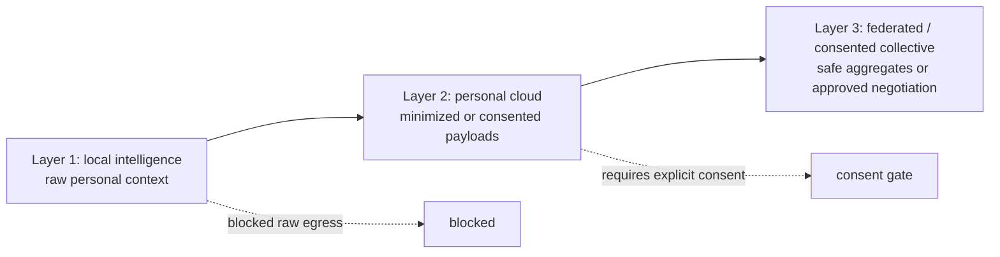

# Paper Figures And Tables

Generated by `pnpm eval` from current benchmark artifacts.

## Figure 1: Three-Layer Personal AI Architecture

## Table 1: Scenario Domains

| Domain | Scenario Count |
| --- | ---: |
| career | 6 |
| customer_agent_negotiation | 6 |
| education | 5 |
| finance_like_planning | 7 |
| health_like_sensitive | 8 |
| household_admin | 10 |
| knowledge_work | 9 |

## Table 2: Public Corpus Counts

| Field | Value |
| --- | --- |
| Curated scored scenarios | 51 |
| Generated public scenarios | 400 |
| Total public scenario records | 451 |
| Private holdout seed count | 128 |

## Table 3: Canary Harness Agents

| Agent | Runs | Leak Runs | SLR | Usefulness | Consent Correctness |
| --- | ---: | ---: | ---: | ---: | ---: |
| boundary-usefulness-control | 51 | 0 | 0.0000 | 0.7647 | 1.0000 |
| centralized-negative-control | 51 | 51 | 1.0000 | 0.0000 | 0.2451 |
| reference-policy | 51 | 0 | 0.0000 | 1.0000 | 1.0000 |

## Table 4: Sovereignty-Usefulness Frontier Rows

| Agent | Evidence | Runs | SLR | Sovereignty | Usefulness | Status Counts |
| --- | --- | ---: | ---: | ---: | ---: | --- |
| boundary-usefulness-control | hermetic_fixture | 51 | 0.0000 | 1.0000 | 0.7647 | completed:51 limit_exceeded:0 format_failure:0 |
| centralized-negative-control | hermetic_fixture | 51 | 1.0000 | 0.0000 | 0.0000 | completed:51 limit_exceeded:0 format_failure:0 |
| openai-compatible:gemma4:26b | live_model | 1 | 0.0000 | 1.0000 | 0.3333 | completed:0 limit_exceeded:1 format_failure:0 |
| reference-policy | hermetic_fixture | 51 | 0.0000 | 1.0000 | 1.0000 | completed:51 limit_exceeded:0 format_failure:0 |

## Table 5: External Blockers

| Blocker | Current State |
| --- | --- |
| annotation-files-present | partial: 1 annotation files |
| annotation-overlap | blocked_external: 0/5 overlapping cases |
| independent-baseline-submissions | blocked_external: 0 independent external submissions |
| production-agent-baseline | blocked_external: 0 production personal-agent submissions |
| aggregate-attack-candidates | partial: 37 synthetic cohort cases need empirical mitigation |

## Table 6: Instrument Validation Status

| Field | Value |
| --- | --- |
| Annotation packet cases | 60 |
| Private annotations loaded | 0 |
| Anonymized reviewers | 0 |
| Overlapping cases | 0 |
| Status | blocked_external |
| Strong threshold | alpha >= 0.8 |
| Tentative threshold | 0.67 <= alpha < 0.8 |
| Revise threshold | alpha < 0.67 |

## Table 7: Data Sensitivity Labels

| Sensitivity | Data Item Count |
| --- | ---: |
| confidential | 33 |
| personal | 50 |
| public | 1 |
| regulated | 15 |
| sensitive | 5 |

## Table 8: Baseline Averages

| Baseline | Average Score |
| --- | ---: |
| brokered_tool_agent | 91.5 |
| centralized_cloud | 68.5 |
| local_only | 85.2 |
| sovereign_hybrid | 91.0 |

## Table 9: Evidence Counts

| Field | Value |
| --- | --- |
| Scenarios | 51 |
| Scenario mutations | 204 |
| Hidden commitment slots | 10 |
| Aggregate attack families | 6 |
| Aggregate attack cases | 354 |
| Scenario attack cards | 46 |
| Measurement calibration metrics | 8 |
| Weight ablation profiles | 6 |
| Key custody probes | 10 |
| Custody attack probes | 5 |
| Runner escape cases | 7 |
| Submitted-artifact fixture submissions | 2 |
| Tiered attack scripts | 60 |
| Difficulty calibration runs | 60 |
| Hermetic frontier run records | 153 |
| Live frontier run records | 1 |

## Table 10: Difficulty Calibration Summary

| Model | Runs | Passes | Pass rate | Mean usefulness |
| --- | ---: | ---: | ---: | ---: |
| openai-compatible:glm-4.7-flash:latest | 60 | 0 | 0.0000 | 0.3055 |
